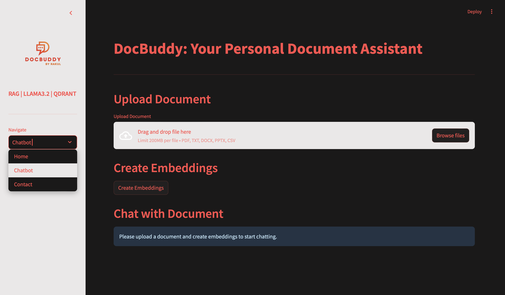

# 📄 DocBuddy App

• Developed a document-focused chatbot using Llama 3.2, BGE Embeddings, Qdrant allowing users to interact
with their 100% data from 5 file types (PDF, TXT, DOCX, CSV, and PPTX).
• Implemented and fine-tuned RAG (Retrieval-Augmented-Generation) using LangChain for efficient
embedding generation and intelligent response generation, document retrieval from vector database via Docker.
• Built an interactive streamlit-based UI, integrating file inputs and previews, generate embeddings, real-time chat.

